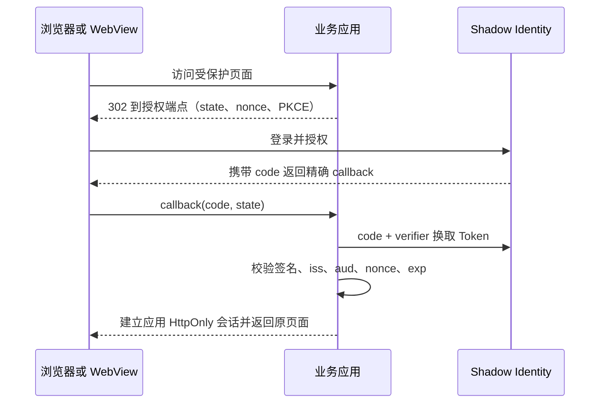

# 应用接入规范

本文是新项目和后续未接入项目的统一规范。仓库中的域名、地址、端口、账号和路径均为
示例；生产值只能存在于仓库外配置。

## 1. 已定方案

- 所有浏览器应用统一使用 OIDC Authorization Code + PKCE。
- 不为新项目设计本地密码、Forward Auth、Hybrid 或双登录兼容层。
- 应用建立并维护自己的服务端会话，Platform 不代理业务请求。
- Agent、MCP、移动同步和定时任务使用独立 Service Bearer，不复用人类登录凭据。
- Health 已上线的 Forward Auth / Hybrid 是既有实现，保持现状但不作为模板。

## 2. 接入前登记

每个项目先在 `catalog/apps.yml` 登记：

1. 稳定 `app_id`、owner、生命周期和唯一规范入口；
2. `auth.mode: oidc` 和最小准入组；
3. 无需登录、无敏感信息的 `health_path`；
4. 是否使用 Media、LLM 和 Agent；
5. 精确的 OIDC redirect URI、post-logout URI，以及最小化的
   `openid profile email groups` scopes。

域名别名只做 308 重定向到规范入口。OIDC 回调、Cookie 和生成链接只认规范入口，避免
同一应用形成两套会话和回调状态。

新增项目和后续完成入口改造的项目使用独立子域名根路径，例如
`https://travel.example.com/`。不要再为主域名增加 `/travel/` 一类项目子路径。NAS 局域网
入口可以继续使用 NAS 地址下的内部子路径，由公网 Nginx 隐藏该实现细节。

## 3. 标准登录链路



应用不得只因为回调中存在 `code` 就建立会话。以下校验全部成功后才能登录：

- `state` 与发起登录时的服务端记录一致且只能使用一次；
- PKCE verifier 与 challenge 匹配；
- ID Token 签名来自已登记 issuer 的当前 JWKS；
- `issuer`、`audience`、`nonce`、`exp`、`iat` 符合预期；
- 用户具备应用要求的最小准入组。

Authelia 的 groups 可能只由 UserInfo endpoint 返回。应用应先完整验证 ID Token，再使用
访问令牌查询 UserInfo；仅当 UserInfo `sub` 与已验证 ID Token `sub` 常量时间一致时，才可
合并 groups、用户名、显示名和邮箱。不得因为 ID Token 缺 groups 就跳过准入检查，也不得
信任 subject 不一致的 UserInfo。

OIDC Token 只在服务端短时使用，不写入 localStorage、模板、日志或业务数据库。

## 4. 用户映射与应用会话

应用用 `(issuer, subject)` 查找或创建本地身份映射，再关联内部 `shadow_user_id`。邮箱、
用户名和显示名是可变属性，不能作为稳定主键。

应用会话至少满足：

- Cookie 设置 `Secure`、`HttpOnly`、`SameSite=Lax`；
- Cookie 默认使用 host-only，Path 收窄到应用入口；
- 登录前保存的 return URL 只能是本站相对路径，防止开放重定向；
- 会话 ID 可撤销、可轮换，登录和权限变化后重新签发；
- 明确提供“仅退出本站”和“退出全部应用”两个动作。

## 5. 浏览器与机器接口分离

浏览器页面使用 OIDC 会话；机器调用使用应用自己的 Bearer。两者不自动互认：

| 调用方 | 凭据 | 失败响应 |
|---|---|---|
| 浏览器 / WebView | 应用会话 Cookie | 302 到本站登录入口 |
| Agent / MCP | Agent Bearer + audience/scopes | 401/403 JSON |
| 移动同步 / BLE 网关 | 项目级 Service Bearer | 401/403 JSON |
| 定时任务 / webhook | 独立服务凭据或签名 | 401/403 JSON |

机器路由不能因缺少凭据而跳转到 Identity，也不能接受浏览器 Cookie 代替 Bearer。写操作
继续要求幂等键、最小权限和业务审计。

## 6. Nginx 与应用边界

新项目的 Nginx 只负责 TLS、限流、请求大小和反向代理，不使用 `auth_request` 建立用户
身份。应用自己完成 OIDC 回调和会话判断。

- 清空客户端提交的 `Remote-User`、`Remote-Groups` 等历史代理身份头；
- 应用端口只绑定回环或私网地址，不直接暴露公网；
- `X-Forwarded-Proto`、Host 和客户端地址只信任明确代理；
- `/healthz` 无状态且不访问数据库；`/readyz` 只供内网或受保护运维检查；
- HTTP 保留 ACME challenge，其余请求再重定向 HTTPS。

Health 所用 `authelia-authrequest.conf` 和代理身份密钥只服务既有链路，新站点不要 include。

## 7. NAS 内部子路径、别名和 WebView

新项目的公网规范入口不使用子路径。若 NAS 内部仍以 `/travel/` 提供服务：

- 公网 Nginx 将 `https://travel.example.com/` 映射到内部路径；
- OIDC redirect URI、Cookie、生成链接和浏览器看到的 URL 仍以公网子域名根路径为准；
- 如应用把内部前缀写入重定向、静态资源、PWA scope 或 Cookie Path，应在项目改造时修正；
- 其他域名只做 308，不在别名域名上建立登录会话；
- WebView 必须允许跳转到 Identity，并保留授权过程中所需 Cookie。

移动端后台同步不依赖 WebView 登录状态，仍走机器 Bearer。

## 8. 媒体接入

浏览器不直接持有媒体服务凭据。业务后端调用控制面：

```text
POST /v1/uploads
POST /v1/uploads/{upload_id}/complete
POST /v1/media/{media_id}/access
DELETE /v1/media/{media_id}
```

业务表保存 `media_id`，不保存预签名 URL。获取私密文件前先检查业务权限，再申请短时
访问地址。

## 9. LLM 与 Agent

LLM 使用进程内 `LLMClient` 或 `AsyncLLMClient`，直接请求供应商；Platform 只提供别名、
Base URL、模型配置和不含正文的统计。提示词、工具、RAG 和结果仍由项目维护。

Agent 使用 `shadow_sdk.agent.AgentAuthenticator` 在项目内验证 Token、audience 和 scopes，
不把请求转发到 Platform。详细边界见 `docs/llm-config.md` 和 `docs/agent-access.md`。

领域 Skill、Prompt、工具和 evals 放在所属项目的 `agent/` 目录，并通过
`contracts/agent-capability-manifest.schema.json` 描述能力。Platform 只维护全局人格、能力
注册、跨项目工作流和 Harness 装载。完整设计和 Foliant/Travel 接入经验见
`docs/unified-agent.md`。

Agent Registry 的 scope 只完成机器主体的粗粒度准入。项目仍须执行资源级权限：例如 Travel
必须检查当前 `agent_id` 是否获得具体地图授权。写入默认采用“生成草案 -> 用户审核 ->
确定性 API 应用”，并要求幂等键；不能相信 Agent 自报的用户身份或资源所有者。

仅由 Agent/服务调用、没有浏览器会话的后台服务登记为 `kind: service` 与
`auth.mode: service-bearer`，`groups` 必须为空，并通过 Agent registry 声明 audience/scopes。
不要把这类服务登记成 Forward Auth 应用，也不要为它创建第二个浏览器 OIDC client。

## 10. 接入验收

- [ ] 未登录访问能完成 OIDC 往返并返回原始相对路径；
- [ ] `state`、nonce 或 PKCE 任一错误都会失败；
- [ ] 错误 issuer、audience、签名和过期 Token 会被拒绝；
- [ ] 无准入组用户返回 403，不创建应用会话；
- [ ] Cookie 的 Secure、HttpOnly、SameSite、Domain 和 Path 正确；
- [ ] 域名别名只返回 308，不建立第二套登录会话；
- [ ] 机器接口缺 Bearer 返回 401，不跳转到登录页；
- [ ] `/healthz` 不泄露依赖信息，`/readyz` 能反映依赖故障；
- [ ] 日志不含 code、Token、Cookie、client secret 或用户正文；
- [ ] OIDC 故障时能按 `docs/migration.md` 回滚整个版本。

## 11. 现有例外

Health 当前仍使用 Forward Auth / Hybrid，这是已经完成的旧项目改造，不继续扩展到其他
项目。维护 Health 时参考其项目文档；设计新项目时只遵循本文的原生 OIDC 路径。

Shadow Nexus 是托管在第三方 DSH Web 内的界面，DSH 当前没有原生 OIDC 接入点，因此它的独立
公网域名允许使用 Authelia Forward Auth 保护整套 HTML、静态资源、API 和 WebSocket。这个门禁
只决定能否进入 Nexus，不向领域服务传递用户授权；Nexus 的 Health、Ledger 等机器调用仍必须
使用彼此独立的 Agent Bearer。局域网字面 IP 是否免认证属于仓库外部署策略，不进入应用目录。
