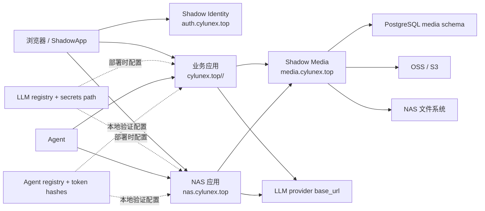
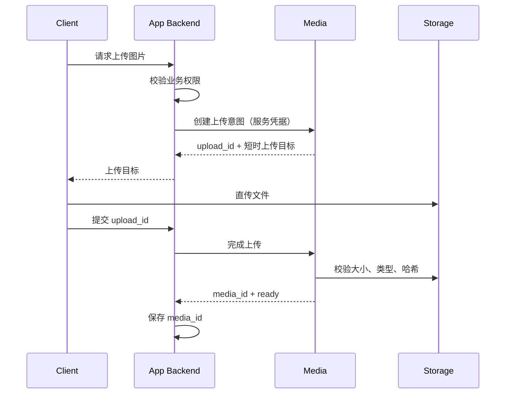

# Shadow Platform 架构

## 1. 范围

Shadow Platform 为所有面向人的 Shadow Web 应用提供统一身份，为需要图片的应用提供统一媒体协议。
同时提供 LLM 非敏感配置、密钥文件约定和 Agent 本地验证规范，但不代理模型或 Agent 流量。

它不负责：

- Garden、Health、Stock、Travel 的业务数据；
- 地图成员、文章编辑者、健康记录所有者等资源级权限；
- Agent/MCP 的长期 API Token 生命周期；
- ShadowVerse、Wingman 等纯 CLI/Skill 项目的登录。

## 2. 逻辑结构



## 3. 身份模型

Authelia 是唯一身份提供方，公开 issuer 为 `https://auth.cylunex.top`。

应用不得把用户名、邮箱或显示名当作稳定主键。统一映射表使用：

```text
shadow_user_id  UUID，Shadow 内部稳定 ID
issuer          OIDC issuer
subject         OIDC sub
username        可变登录名
display_name    可变显示名
email           可变联系地址
```

`UNIQUE (issuer, subject)` 保证同一外部身份只映射到一个 Shadow 用户。未来替换身份提供方时，可以增加映射而不修改业务外键。

### 3.1 SSO 与应用会话

每个应用完成 Authorization Code + PKCE 流程，并建立自己的 HttpOnly 会话。应用之间不共享业务 Cookie；用户访问另一个应用时会短暂跳转 Identity，并利用已有身份会话自动返回。

现有应用迁移前可以临时使用 Nginx `auth_request`，但目标状态仍是应用原生 OIDC。原生 OIDC 可以在 NAS 上本地验证签名后的令牌，避免每个业务请求都回云端鉴权。

### 3.2 用户组

首批组：

| 组 | 用途 |
| --- | --- |
| `shadow-admins` | 平台管理 |
| `garden-admins` | Garden 管理后台 |
| `health-users` | Health 页面准入 |
| `stock-users` | Stock 页面准入 |
| `travel-users` | Travel 应用准入 |

组只决定能否进入应用。Travel 的主题地图成员、角色和分享权限保存在 Travel 自己的数据库中。

## 4. NAS 直连

IP 地址不能可靠参与跨域 OIDC 和 HTTPS。目标方案使用 `nas.cylunex.top` 在局域网解析到 `192.168.0.21`，并使用 DNS-01 签发的证书。ShadowApp 内网路由改用 `https://nas.cylunex.top:55080`，外网仍使用云端路由。

迁移完成前，NAS 原入口保留为应急入口，不把旧认证移除。

## 5. 媒体模型

业务应用只保存 `media_id`。媒体中心保存：

- 所属应用、所有者 subject 和业务资源引用；
- 原始文件名、声明 MIME、实际 MIME、尺寸、字节数、SHA-256；
- 存储配置、对象键、处理状态、可见性；
- 创建、完成、软删除和清理时间；
- 缩略图、WebP 等变体关系。

可见性：

| 值 | 语义 |
| --- | --- |
| `public` | 可以返回长期公共 URL |
| `private` | 只有业务服务确认后才签发短时 URL |
| `scoped` | 与协作资源绑定，仍由业务服务逐次授权 |

## 6. 上传时序



客户端不能自行指定可信的 `app_id`。媒体服务从服务凭据识别调用方，并拒绝跨应用访问。

## 7. 存储路由

首期建议：

| namespace | 后端 | 默认可见性 |
| --- | --- | --- |
| `garden` | Aliyun OSS | public |
| `travel` | Aliyun OSS | scoped |
| `health` | NAS 文件系统 | private |

媒体 ID 与存储对象键解耦。更换 bucket、迁移 NAS 或增加 CDN 不改变业务表。

## 8. 部署单元

- Authelia：容器，监听云服务器回环地址 `127.0.0.1:9091`。
- Media：FastAPI，监听回环地址，建议端口 `8400`，由 systemd 管理。
- PostgreSQL：独立数据库或 schema，使用最小权限账号。
- Redis：Authelia 会话专用 ACL 用户和 DB index。
- Nginx：唯一公网入口，负责 TLS、限流、请求体限制和可信转发头。

## 9. LLM 配置与直连

平台不部署 AI Gateway。版本化 registry 统一：

- `openai-compatible` 或 `anthropic` 协议类型；
- `responses`、`chat-completions` 或 `messages` 原生 API；
- Provider Base URL；
- `chat-default`、`reasoning-default`、`vision-default` 等稳定别名；
- 实际模型、超时和备用别名；
- 每项目密钥文件的相对位置。

部署脚本将选定别名解析为项目自己的 `llm.env`，其中只包含密钥文件路径。共享 SDK 在各项目进程内完成同步、异步和流式直连，并可把 Token、延迟、状态等固定元数据写入本地 outbox。平台不接触提示词、图片、工具参数、回答或流式数据；统计链路故障也不影响模型请求。

## 10. Agent 接入

平台不部署 Agent Gateway。Agent registry 统一 `agent_id`、负责人项目、audience、scopes、禁用状态和 Token 摘要文件。各应用通过共享 SDK 在本地验证 Bearer Token，并继续由自己的 API/MCP 层检查资源权限、幂等和审计。

凭据文件只保存高熵 Token 的 SHA-256，可同时配置当前和下一份摘要完成无停机轮换。平台不集中搬运 Foliant 工具、Health 写入接口或 Travel 规划逻辑。
