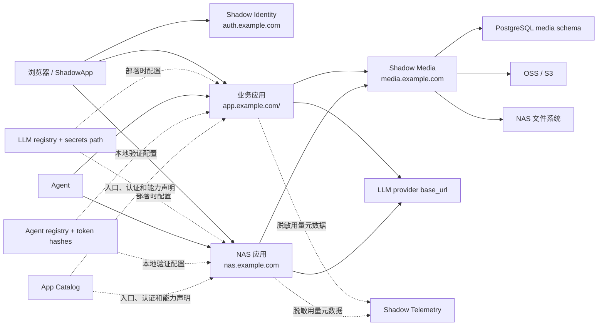
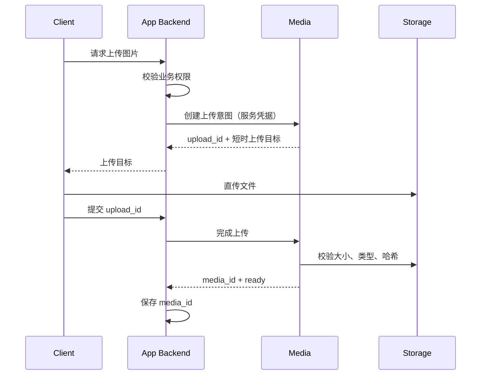

# Shadow Platform 架构

## 1. 范围

Shadow Platform 为所有面向人的 Shadow Web 应用提供统一身份，并通过 Asset Service 提供统一文件协议。
同时提供 LLM 非敏感配置、密钥文件约定和 Agent 本地验证规范，但不代理模型或 Agent 流量。

它不负责：

- Garden、Health、Stock、Travel 的业务数据；
- 地图成员、文章编辑者、健康记录所有者等资源级权限；
- Agent/MCP 的长期 API Token 生命周期；
- ShadowVerse、Wingman 等纯 CLI/Skill 项目的登录。

## 2. 逻辑结构



## 3. 身份模型

Authelia 是唯一身份提供方，公开 issuer 为 `https://auth.example.com`。

应用不得把用户名、邮箱或显示名当作稳定主键。统一映射表使用：

```text
shadow_user_id  UUID，Shadow 内部稳定 ID
issuer          OIDC issuer
subject         OIDC sub
username        可变登录名
display_name    可变显示名
email           可变联系地址
```

`UNIQUE (issuer, subject)` 保证同一外部身份只映射到一个 Shadow 用户。未来替换身份提供方时，可以增加映射而不修改业务外键。

### 3.1 SSO 与应用会话

每个应用完成 Authorization Code + PKCE 流程，并建立自己的 HttpOnly 会话。应用之间不共享业务 Cookie；用户访问另一个应用时会短暂跳转 Identity，并利用已有身份会话自动返回。

新项目和后续未接入项目只实现原生 OIDC，不再增加 Nginx `auth_request`、旧密码或双登录
兼容层。Health 已存在的 Forward Auth / Hybrid 链路保持现状，视为不向其他项目扩展的
既有例外。

### 3.2 用户组

首批组：

| 组 | 用途 |
| --- | --- |
| `shadow-users` | Shadow 通用个人服务准入 |
| `shadow-admins` | 平台管理 |
| `garden-admins` | Garden 管理后台 |
| `health-users` | Health 页面准入 |
| `ledger-users` | Ledger 个人财务与消费准入 |
| `stock-users` | Stock 页面准入 |
| `travel-users` | Travel 应用准入 |

组只决定能否进入应用。Travel 的主题地图成员、角色和分享权限保存在 Travel 自己的数据库中。

## 4. NAS 直连

IP 地址不能可靠参与跨域 OIDC 和 HTTPS。目标方案使用 `nas.example.com` 在局域网解析到 `192.0.2.10`，并使用 DNS-01 签发的证书。ShadowApp 内网路由改用 `https://nas.example.com:18080`，外网仍使用云端路由。

后续项目的 NAS 与公网入口使用同一 OIDC 身份模型；域名别名只重定向到规范入口，不建立
第二套会话。Health 已有的内网恢复入口不作为新项目设计依据。

## 5. 统一资产模型

新项目只保存 `asset_id`，业务对象与文件的关系以 `AssetReference` 为唯一真相。物理字节在
`Blob` 层按 SHA-256 去重，权限与生命周期在 `Asset` 层隔离，内容变更形成 `AssetVersion`，
缩略图和预览等输出仍是完整 Asset 并由 `AssetDerivative` 关联。详细约束见
`docs/asset-service-v1.md`。

### 5.1 旧媒体兼容模型

业务应用只保存 `media_id`。媒体中心保存：

- 所属应用、所有者 subject 和业务资源引用；
- 原始文件名、声明 MIME、实际 MIME、尺寸、字节数、SHA-256；
- 存储配置、对象键、处理状态、可见性；
- 创建、完成、软删除和清理时间；
- 缩略图、WebP 等变体关系。

可见性：

| 值 | 语义 |
| --- | --- |
| `public` | 可以返回长期公共 URL |
| `private` | 只有业务服务确认后才签发短时 URL |
| `scoped` | 与协作资源绑定，仍由业务服务逐次授权 |

## 6. 上传时序



客户端不能自行指定可信的 `app_id`。媒体服务从服务凭据识别调用方，并拒绝跨应用访问。

## 7. 存储路由

当前本地/NAS 首版：

| namespace | 后端 | 默认可见性 |
| --- | --- | --- |
| `garden` | 本地/NAS 文件系统 | public |
| `travel` | 本地/NAS 文件系统 | scoped |
| `health` | NAS 文件系统 | private |

媒体 ID 与存储对象键解耦。后续接入 Aliyun OSS/S3、更换 bucket、迁移 NAS 或增加 CDN 时不改变业务表。

## 8. 部署单元

- Authelia：容器，监听云服务器回环地址 `127.0.0.1:9091`。
- Media：FastAPI，监听回环地址，建议端口 `8400`，由 systemd 管理。
- Telemetry：FastAPI，监听回环地址 `8410`，只接收固定 LLM 用量字段。
- PostgreSQL：独立数据库或 schema，使用最小权限账号。
- Redis：Authelia 会话专用 ACL 用户和 DB index。
- Nginx：唯一公网入口，负责 TLS、限流、请求体限制和可信转发头。

## 9. LLM 配置与直连

平台不部署 AI Gateway。版本化 registry 统一：

- `openai-compatible` 或 `anthropic` 协议类型；
- `responses`、`chat-completions` 或 `messages` 原生 API；
- Provider Base URL；
- `chat-default`、`reasoning-default`、`vision-default` 等稳定别名；
- 实际模型、超时和备用别名；
- 每项目密钥文件的相对位置。

部署脚本将选定别名解析为项目自己的 `llm.env`，其中只包含密钥文件路径。共享 SDK 在各项目进程内完成同步、异步和流式直连，并可把 Token、延迟、状态等固定元数据写入本地 outbox。平台不接触提示词、图片、工具参数、回答或流式数据；统计链路故障也不影响模型请求。

## 10. Agent 控制面

平台不部署 Agent Gateway。Agent registry 统一 `agent_id`、负责人项目、audience、scopes、
禁用状态和 Token 摘要文件。各应用通过共享 SDK 在本地验证 Bearer Token，并继续由自己的
API/MCP 层检查资源权限、幂等和审计。

统一 Agent 采用控制面与数据面分离：

- Platform 管理全局人格、能力合同、路由、跨项目工作流和 Harness adapter；
- 各项目管理领域 Skill、Prompt、工具实现和 evals；
- Harness 在部署时装载各项目能力包，并使用目标项目的独立凭据直接调用；
- 一个用户可见人格不对应一个全权限 Token，项目凭据不能互相替代。

凭据文件只保存高熵 Token 的 SHA-256，可同时配置当前和下一份摘要完成无停机轮换。
Capability Manifest 使用 `contracts/agent-capability-manifest.schema.json` 描述稳定能力、工具、
数据敏感度、确认、资源授权和幂等要求。完整边界与 Foliant/Travel 的实践结论见
`docs/unified-agent.md`。

## 11. 新项目公网入口

新增项目和后续完成入口改造的项目默认使用独立子域名根路径，例如
`https://travel.example.com/`，不再使用主域名的 `/travel/` 一类子路径。部署在 NAS 的应用
仍可在局域网保留 `http://nas.example.com/<app>/` 内部路径，由公网子域名的 Nginx 入口完成
代理；内部路径不能演变成主域名的公开子路径。

已经上线的旧入口不要求仅为统一形式立即迁移，随项目正常改造处理。
