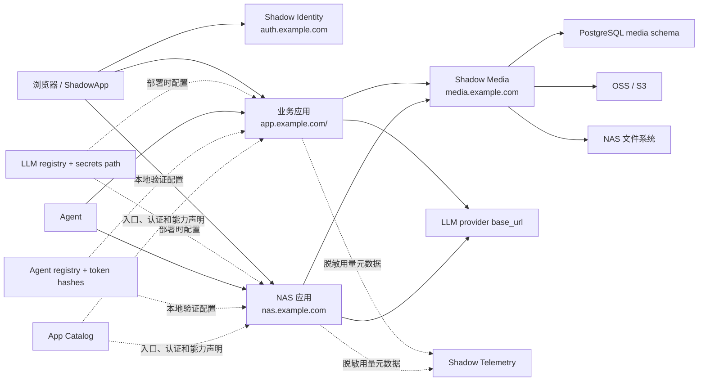
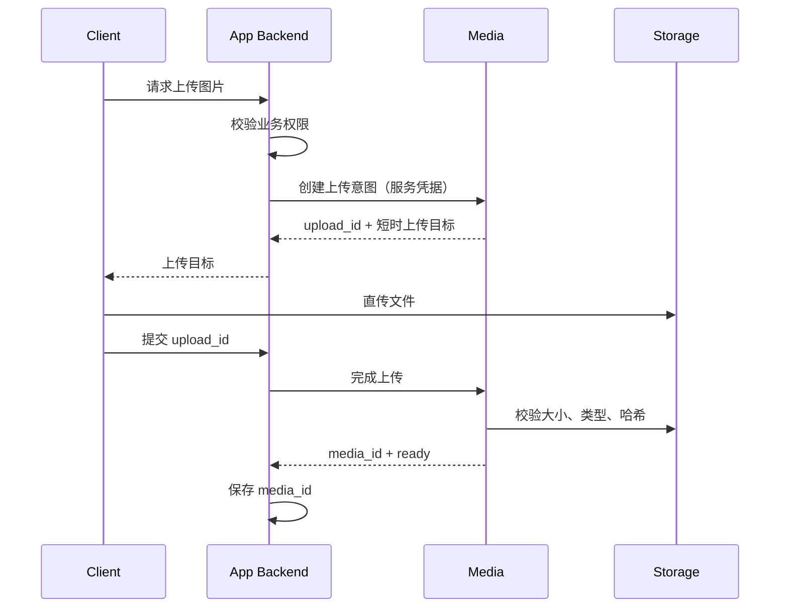

# Shadow Platform 架构

> 2026-09-07 设计衔接：统一鉴权、Agent 与 Nexus 目标规范以 [Platform UA-1](nexus-unified-access-design.md) 为准。不再新增领域自管 OIDC/Session、Agent registry/Grant/审批中心或模型/工具通用循环；普通明确写入采用中央 current_intent。旧“无 Gateway/仅本地鉴权/平台永不处理 Prompt”属于被替代的目标约定。以下相关条目仅描述旧实现/历史阶段，不能作为新增实现继续复制；未迁移接口仍保留当前安全限制。

## 1. 范围

Shadow Platform 为所有面向人的 Shadow Web 应用提供统一身份，并通过 Asset Service 提供统一文件协议。
目标统一 Access/Session、Agent/MCP 与模型 Gateway；业务资源权限与事实留领域。下图及未改造章节描述 legacy 基线，目标链路以 UA-1 为准。

它不负责：

- Garden、Health、Stock、Travel 的业务数据；
- 地图成员、文章编辑者、健康记录所有者等资源级权限；
- 领域业务事务与事实计算；Agent/MCP 的公共传输、鉴权和目录属于 Platform；
- ShadowVerse、Wingman 等纯 CLI/Skill 项目的登录。

## 2. 逻辑结构



## 3. 身份模型

Authelia 是唯一身份提供方，公开 issuer 为 `https://auth.example.com`。

应用不得把用户名、邮箱或显示名当作稳定主键。统一映射表使用：

```text
shadow_user_id  UUID，Shadow 内部稳定 ID
issuer          OIDC issuer
subject         OIDC sub
username        可变登录名
display_name    可变显示名
email           可变联系地址
```

`UNIQUE (issuer, subject)` 保证同一外部身份只映射到一个 Shadow 用户。未来替换身份提供方时，可以增加映射而不修改业务外键。

### 3.1 SSO 与应用会话

目标由中央登录服务和共享 SDK 完成 Authorization Code + PKCE；Session 状态统一管理，各应用只设置 host-only handle Cookie，不自建会话库。旧实现继续本地会话直至迁移完成。

新项目和后续未接入项目只实现原生 OIDC，不再增加 Nginx `auth_request`、旧密码或双登录
兼容层。Health 已存在的 Forward Auth / Hybrid 链路保持现状，视为不向其他项目扩展的
既有例外。

### 3.2 用户组

首批组：

| 组 | 用途 |
| --- | --- |
| `shadow-users` | Shadow 通用个人服务准入 |
| `shadow-admins` | 平台管理 |
| `garden-admins` | Garden 管理后台 |
| `health-users` | Health 页面准入 |
| `ledger-users` | Ledger 个人财务与消费准入 |
| `stock-users` | Stock 页面准入 |
| `travel-users` | Travel 应用准入 |

组只决定能否进入应用。Travel 的主题地图成员、角色和分享权限保存在 Travel 自己的数据库中。

## 4. NAS 直连

IP 地址不能可靠参与跨域 OIDC 和 HTTPS。目标方案使用 `nas.example.com` 在局域网解析到 `192.0.2.10`，并使用 DNS-01 签发的证书。ShadowApp 内网路由改用 `https://nas.example.com:18080`，外网仍使用云端路由。

后续项目的 NAS 与公网入口使用同一 OIDC 身份模型；域名别名只重定向到规范入口，不建立
第二套会话。Health 已有的内网恢复入口不作为新项目设计依据。

## 5. 统一资产模型

新项目只保存 `asset_id`，业务对象与文件的关系以 `AssetReference` 为唯一真相。物理字节在
`Blob` 层按 SHA-256 去重，权限与生命周期在 `Asset` 层隔离，内容变更形成 `AssetVersion`，
缩略图和预览等输出仍是完整 Asset 并由 `AssetDerivative` 关联。详细约束见
`docs/asset-service-v1.md`。

### 5.1 旧媒体兼容模型

业务应用只保存 `media_id`。媒体中心保存：

- 所属应用、所有者 subject 和业务资源引用；
- 原始文件名、声明 MIME、实际 MIME、尺寸、字节数、SHA-256；
- 存储配置、对象键、处理状态、可见性；
- 创建、完成、软删除和清理时间；
- 缩略图、WebP 等变体关系。

可见性：

| 值 | 语义 |
| --- | --- |
| `public` | 可以返回长期公共 URL |
| `private` | 只有业务服务确认后才签发短时 URL |
| `scoped` | 与协作资源绑定，仍由业务服务逐次授权 |

## 6. 上传时序



客户端不能自行指定可信的 `app_id`。媒体服务从服务凭据识别调用方，并拒绝跨应用访问。

## 7. 存储路由

当前本地/NAS 首版：

| namespace | 后端 | 默认可见性 |
| --- | --- | --- |
| `garden` | 本地/NAS 文件系统 | public |
| `travel` | 本地/NAS 文件系统 | scoped |
| `health` | NAS 文件系统 | private |

媒体 ID 与存储对象键解耦。后续接入 Aliyun OSS/S3、更换 bucket、迁移 NAS 或增加 CDN 时不改变业务表。

## 8. 部署单元

- Authelia：容器，监听云服务器回环地址 `127.0.0.1:9091`。
- Media：FastAPI，监听回环地址，建议端口 `8400`，由 systemd 管理。
- Telemetry：FastAPI，监听回环地址 `8410`，只接收固定 LLM 用量字段。
- PostgreSQL：独立数据库或 schema，使用最小权限账号。
- Redis：Authelia 会话专用 ACL 用户和 DB index。
- Nginx：唯一公网入口，负责 TLS、限流、请求体限制和可信转发头。

## 9. 统一模型接入

目标使用 Platform Model Gateway 和共享 client，集中维护 Provider 凭据、传输、预算和 fallback；领域保留 Prompt/Skill/eval、计算与数据口径。中央临时处理必要正文，默认不持久记录；用途和敏感数据披露按 UA-1 校验。

当前 `llm_client.py` 的进程内直连作为迁移来源，传输实现复用到中央；不再要求每域维护独立模型连接器。

## 10. 统一 Access 与 Agent Runtime

目标由 Platform 集中维护主体、Session、委托、撤销、内联确认、工具目录和通用运行组件，Nexus 复用 DSH loop。领域挂载 SDK，只保留业务 ACL、事务、任务与真实 Receipt。

当前 registry + token hash + 本地 AgentAuthenticator 只用于 legacy 兼容。按 capability 切 central 后旧路径拒绝，不在中央故障时回退旧授权。主体/数据模型、票据/claim、迁移与验收见 [UA-1](nexus-unified-access-design.md)。

## 11. 新项目公网入口

新增项目和后续完成入口改造的项目默认使用独立子域名根路径，例如
`https://travel.example.com/`，不再使用主域名的 `/travel/` 一类子路径。部署在 NAS 的应用
仍可在局域网保留 `http://nas.example.com/<app>/` 内部路径，由公网子域名的 Nginx 入口完成
代理；内部路径不能演变成主域名的公开子路径。

已经上线的旧入口不要求仅为统一形式立即迁移，随项目正常改造处理。
