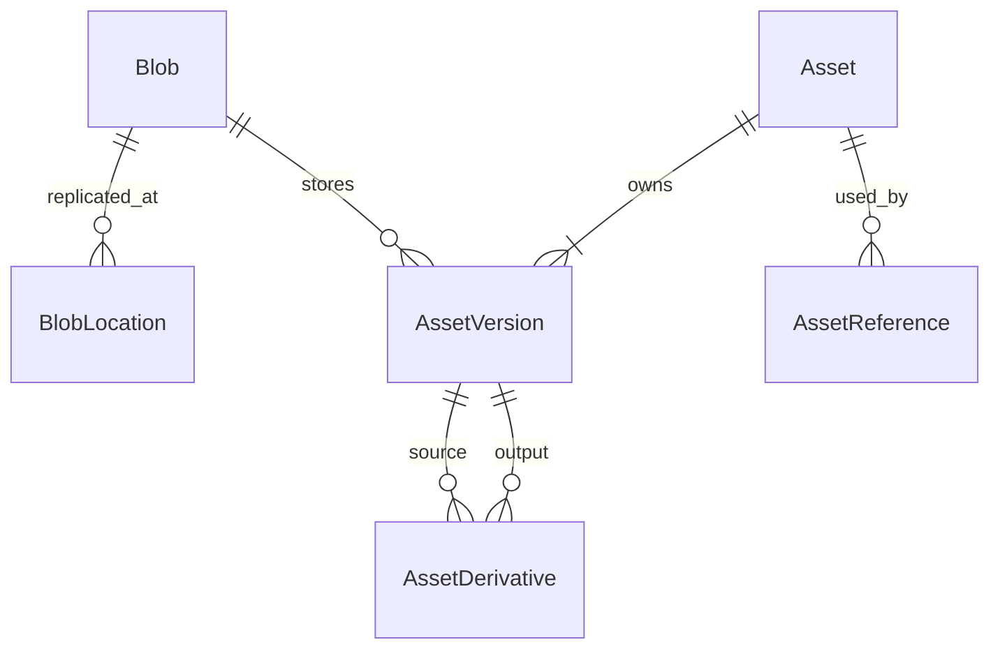

# Shadow Asset Service v1.0

## 1. 定位与边界

Shadow Asset 是单用户/家庭规模 Shadow 系列的统一文件地基。它管理文件字节、逻辑文件、
版本、业务引用、衍生关系、访问授权、保留与清理；不理解化验单、文章、行程或档案等业务语义。

正式边界固定为：

```text
Platform Asset：管文件资产的生命周期
Archive：管资料与知识的生命周期
Domain Projects：管业务语义的生命周期
```

业务项目只能创建或解绑 `AssetReference`，不能删除 Blob 或直接操作存储键。Archive 的 PDF、
WARC、HTML 快照等实际文件同样进入 Asset；Archive 只保存档案语义、Revision、Representation
和 Segment 定位。

## 2. 核心模型



- `Blob`：真实不可变字节、SHA-256、大小、完整性和 GC 标记。相同哈希和大小只保存一次。
- `BlobLocation`：Blob 在某个 Storage Port 后端中的对象键和校验状态。
- `Asset`：用户可见逻辑文件，承载所有者、权限、敏感度和生命周期。
- `AssetVersion`：Asset 的具体内容版本。当前版本只是指针，不决定历史版本是否可达。
- `AssetReference`：业务 URI 如何使用 Asset；这是跨项目引用关系的唯一真相。
- `AssetDerivative`：两个完整 AssetVersion 之间的生成关系，不另造 Variant 文件模型。

一个 Blob 可以服务多个 Asset，但权限永远在 Asset 层判断，不能因物理去重串权。

## 3. 权限和所有权

`ownership_mode`：

- `user_owned`：用户主动保存在资产中心；即使零业务引用也不能自动清理。
- `app_managed`：由业务项目生命周期管理；零引用达到宽限期后自动进入回收站。
- `derived`：缩略图、预览图、转码等衍生资产；仍是完整 Asset。

`access_mode`：

- `private`：仅创建者应用可授权访问。
- `delegated`：持有活动引用的其他应用也可授权访问。
- `public`：可公开读取；`restricted` 敏感度禁止与它组合。

创建者可以通过“显式引用委派”把一个具体 `private` Asset 挂载给已注册目标应用。委派不会把
Asset 整体改成 `delegated`：目标应用只能解析自己的稳定 `shadow://{target_app}/...` 引用，并为
该引用指向的版本申请短时读取授权。引用记录保留 `delegated_by_app_id` 供审计；目标应用或委派者
都可以解绑，目标应用不能自行恢复已被委派者撤销的私有引用。

所有服务端调用使用各应用独立 Bearer 凭据。服务只能在业务侧先完成用户授权后请求 Asset；
Asset 不替业务项目判断记录权限。非公开内容通过具体 `AssetVersion` 的短时 HMAC URL 读取，
日志不得记录查询参数。

## 4. 引用一致性

引用目标统一使用不透明 URI，例如：

```text
shadow://health/lab-reports/{id}
shadow://travel/visits/{id}
shadow://archive/records/{id}
```

餐图等跨应用捕获使用相同规则，例如
`shadow://health/meals/2026-09-01/lunch`。创建者以自己的服务凭据调用委派接口并指定目标应用；
Health 随后只使用自己的服务凭据按 URI 解析、签发短时读取 URL，不接触创建者的 Token。

`(app_id, reference_key)` 唯一，实现幂等创建与安全重试。业务项目应在本地事务中写 Outbox，
失败后重试引用创建/解绑；Platform 通过 outbox 和审计事件支持定期对账。首版不引入分布式事务。

引用绑定规则由数据库和 API 双重约束：

- `pinned` 必须指定 `pinned_version_id`，且版本属于同一 Asset；
- `latest` 必须不带 `pinned_version_id`；
- 已释放的同 key 引用可按原参数幂等恢复；参数不一致返回冲突。

## 5. 上传、校验与去重

上传采用三步协议：创建短时 Upload Session、PUT 原始字节、幂等完成。完成时进行大小、允许
MIME、格式签名/可解析性和 SHA-256 校验，然后先落 Blob，再创建独立 Asset 与首个版本。

Asset 服务保留用户原件，不重编码、不移除 EXIF。后续预览或脱敏副本应创建 `derived` Asset，
并用 `AssetDerivative` 记录 recipe、generator、版本和参数哈希。

本地/NAS 存储键为内容寻址：

```text
blobs/sha256/{前2位}/{次2位}/{完整sha256}
```

staging 与最终 Blob 目录位于同一文件系统时使用原子 `rename`。跨文件系统不能假设 rename
原子性，必须复制到目标文件系统临时文件、fsync、校验大小和 SHA-256，再在目标目录内原子切换；
失败时保留可重试状态。

## 6. 生命周期与 GC

Asset 状态为 `active -> trashed -> purged`。默认策略：

- `app_managed` 在活动引用归零时记录 `zero_referenced_at`；持续 7 天后自动进入回收站；
- 进入回收站后默认保留 30 天，只改变逻辑状态，不直接删除物理文件；
- `user_owned` 零引用仍是正常资产，不属于 orphan；
- `active` 或 `trashed` Asset 的全部未显式删除历史版本都是 GC root；
- 只有版本显式删除或 Asset 已 `purged`，并且 Blob 不再被任何可达版本使用时，才能成为候选；
- Blob 先标记、经过最短安全期和再次校验后才允许物理删除。

首版清理任务只完成状态转换和 GC 候选标记，不自动物理删除 Blob。这给备份、对账和误删恢复
留出安全窗口。

## 7. 衍生资产与后台任务

`AssetDerivative` 禁止自引用；API 在创建时遍历有效边检查环路。相同 source、recipe、recipe
version 和 parameters hash 唯一，重复任务可安全重试。任务队列使用 PostgreSQL 表，不增加 Redis、
Kafka 或独立工作流系统；v1 先建立表和合同，缩略图/OCR/转码 worker 按实际需求逐项加入。

## 8. 存储接口

业务代码只依赖 Storage Port 的 staging、finalize、open、verify 和 delete 能力。v1 实现本地/NAS
文件系统；Blob 与 Location 分离后可增加 S3/OSS 或第二副本，不改变 Asset ID 和业务引用。

Nginx 只负责 TLS、大小限制、限流和流式转发；不能做权限判断，也不能暴露真实对象键。

## 9. 兼容与迁移

旧 `/v1/media/*` API 保持可用。`scripts/backfill_assets.py` 使用显式 owner subject 到 UUID 映射，
将旧 `MediaObject` 幂等登记为 Blob、Location、Asset、Version、Reference 和 Legacy Map；不会移动或
改写旧文件。由于旧图片可能已经过去元数据，回填版本明确标记 `migrated_sanitized`。

数据库升级使用：

```bash
.venv/bin/alembic upgrade head
```

生产回填前必须备份数据库和对象目录，先在副本上 dry-run/核对所有者映射，再安排窗口执行。

## 10. v1 非目标

为控制复杂度，v1 不包含独立 DAM 门户、文件夹树、内容标签体系、全文/RAG 索引、协同编辑、
跨地域复制编排、断点续传或自动物理 GC。它们以后只能通过 Asset ID/Version/Reference 扩展，
不能绕过本设计再建立一套文件真相。
