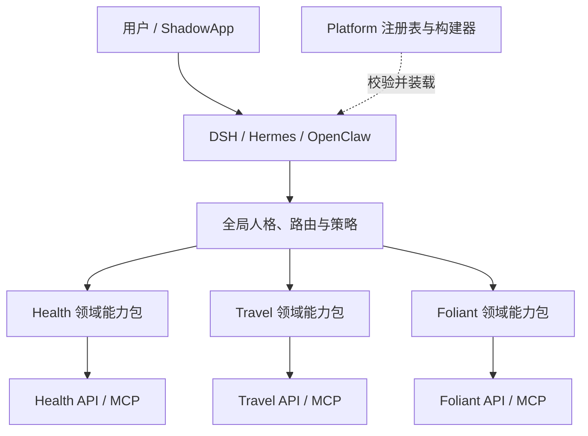

# Shadow 统一 Agent 设计

本文定义 Shadow 系列如何向用户提供一个统一 Agent 体验，同时让领域 Skill、Prompt、工具、
权限和数据继续归所属项目维护。本文中的域名、路径和身份均为示例；生产信息不得进入仓库。

## 1. 决策

Shadow 统一的是 Agent 的入口和控制面，不集中业务智能，也不部署 Agent Gateway：

- 用户只面对统一的 Shadow 人格；
- Health、Travel、Foliant、Garden、Verse 等项目拥有自己的领域能力包；
- Platform 作为 Agent Control Plane，统一身份、插件合同、Profile 策略和 Harness Bundle；
- Harness 使用项目级凭据直接调用项目 API/MCP，Platform 不转发调用；
- LLM 仍由项目内 SDK 直连供应商，Platform 不接触 Prompt、工具参数或回答。



## 2. 所有权边界

谁拥有业务语义，谁就拥有对应的 Agent 资产。

领域项目维护：

```text
agent/
├── manifest.yaml
├── skills/
├── prompts/
└── evals/
```

- `skills/`：面向 Harness 的领域操作说明；
- `prompts/`：项目内部生成、提取、评估等 Prompt；
- `evals/`：领域正确性、工具选择、权限拒绝和降级测试；
- `manifest.yaml`：仅声明稳定能力、所需工具和安全属性，不保存密钥或运行时地址。

Platform 维护：

```text
contracts/         # 插件、能力、Profile 和运行时公共合同
agents/            # principal、实例与 Profile 示例
scripts/           # 校验器和 Bundle Builder
docs/              # 控制面规范与接入边界
```

Platform 不拥有跨项目业务 Prompt。单项目工作流留在所属项目；同时消费两个及以上领域能力
的流程使用独立 `ShadowCompositionPlugin`，由 Platform 注册和构建，但不进入 Platform 核心。

## 3. 四类注册信息

| 合同 | 回答的问题 | 来源 |
| --- | --- | --- |
| App Catalog | Shadow 有哪些应用及其入口和基础能力 | `catalog/apps.yml` |
| Agent Registry | 哪个机器主体正在调用、可访问哪些 audience/scopes | `agents/registry.yml` |
| Capability Manifest | 领域项目提供哪些能力、工具及安全属性 | 各项目 `agent/manifest.yaml` |
| Workflow Definition | 哪些能力按什么顺序组成跨项目流程 | Platform `agent/workflows/` |

Agent Registry 是调用者身份，不是 Skill 清单。Capability Manifest 是可发现的业务能力，
不能保存 Token。两者必须同时满足，但互不替代。

Manifest 使用 `contracts/agent-capability-manifest.schema.json`。稳定 capability id 和 scope
建议使用 `<domain>.<resource>.<verb>`，例如 `travel.maps.read`；已经发布的
`stock.read`、`stock.research` 等较短 scope 保持兼容，不为形式统一进行破坏性重命名。

Manifest 的安全字段含义：

| 字段 | 作用 |
| --- | --- |
| `effect` | 区分只读、创建草案、正式写入和删除 |
| `data_classification` | 标识公开、内部、个人或敏感数据 |
| `confirmation` | 声明执行前或应用草案前是否必须确认 |
| `resource_grant_required` | 除 Registry scope 外是否还需资源级授权 |
| `idempotency_required` | 是否必须携带幂等键 |

Prompt 或 Skill 只能收紧这些要求，不能降低服务端实际权限检查。

## 4. 身份、人格与授权

Shadow 是用户可见人格，不等于一个拥有全部权限的机器主体。运行时应为每个领域配置独立
Agent principal 和凭据，例如 Health、Travel、Foliant 各一份；Harness 根据目标 audience
选择凭据。不要创建一个可访问所有项目的万能 Token。

一次调用至少经过三层授权：

1. Agent Registry 验证 `agent_id`、audience、scopes、capability grants 和禁用状态；
2. 业务项目验证资源级权限，例如 Travel 的地图授权或 Health 的数据所有权；
3. 写操作验证确认状态、幂等键、业务规则和审计要求。

当前 Service Bearer 只代表机器身份，不能代表某个 OIDC 用户。项目不得信任 Agent 自报的
`actor_sub`、用户名或资源所有者。需要代表用户执行时，第一阶段使用应用内显式资源授权和
待确认草案；未来如引入用户委托令牌，必须是短时、可撤销、绑定 audience/scope/resource
的独立协议。

全局人格只控制措辞、结果组织和路由，不得覆盖项目的风控阈值、数据事实或权限决定。

## 5. 运行时聚合

源码不复制到统一 Agent 仓库。Platform 构建器读取各项目 Manifest，校验文件与能力引用，
再为目标 Harness 生成不可变运行时包。DSH 首期使用一份通用 Adapter Bundle，各领域只是
生成配置实例，不分别发布 npm 包：

```text
领域仓库 agent/skills
        ↓ schema 与语义校验
Platform bundle builder
        ↓ 原子发布
generated-profile/
├── domain.js
├── policy.js
├── runtime.js
├── profile.generated.js
├── skills/                 # 经校验的只读快照
├── shadow-runtime-manifest.json
└── agent-bundle.lock
```

`agent-bundle.lock` 记录项目与实例版本、Manifest/Skill/合同输入摘要、精确 Runtime 版本和
确定性 build id。运行时目录不得反向成为源码；任何修改必须回到领域仓库。Windows、NAS 和容器间
为避免软链接差异，发布使用临时目录生成、校验后原子切换，而不是就地覆盖。

Harness adapter 只处理目录结构、元数据格式和工具名称映射，不复制领域 Prompt，也不改变
capability id、scope 或确认策略。

## 6. 跨项目工作流

跨项目工作流引用 capability id，不直接依赖项目内部函数或数据库。例如：

```text
travel.visits.summarize
  -> health.activity.draft
  -> garden.posts.draft
```

Platform 已提供首个可运行的只读 Composition Plugin：`shadow-daily-overview`。它按日期读取
Health 摘要，再按月份和币种读取 Ledger 摘要；任一领域不可用时返回有界降级结果，不缓存两边
正文。它是合同、构建和隔离方式的示例，不是新的聚合数据库。

工作流必须：

- 每一步分别使用目标项目的独立凭据；
- 只传递下一步需要的最小字段，不汇总完整健康、金融或位置数据；
- 继承每个 capability 的资源授权、确认和幂等要求；
- 使用统一 `request_id` / `trace_id` 串联审计，但不集中记录正文；
- 中间失败时保持已提交写入可识别、可重试，不用 Prompt 猜测事务结果。

当前 Composition 只允许顺序调用 L0 只读/分析能力。涉及写入、发布、删除或资金执行时，应由
领域项目提供草案/确认 API；在补偿、重放和持久队列合同成熟前，不扩展成跨项目写事务。

只有跨项目流程需要独立持久状态、任务队列、扩缩容或发布周期时，才考虑拆出
`shadow-orchestrator`。当前不提前建立该仓库。

## 7. Foliant 接入经验

Foliant 从无 Web 鉴权的全局数据应用改造成 Stock Web + Foliant Service 两个清晰边界，
验证了以下要求：

1. **逐路由分类而不是只按路径前缀保护。** 浏览器 API 数量多且敏感度不同，必须建立
   public、readiness、user、administrator、machine-read、machine-research 的显式矩阵；
   新路由未分类时启动或测试直接失败。
2. **全局数据不能因为完成 OIDC 就自动变成多租户。** 未完成所有权迁移前，持仓、成交、
   环境配置和任务控制只允许管理员访问。
3. **浏览器和机器身份完全分离。** Stock 使用 OIDC 会话，Foliant 使用 audience
   `foliant` 与 `stock.read` / `stock.research`，两类凭据不能互认。
4. **审计采用允许列表。** 只记录 request id、actor id、路由模板、策略、结果和状态码，
   不记录路由实值、请求体、持仓或 Prompt。
5. **SDK 迁移不改变业务 Prompt 所有权。** Foliant 的 LLM 调用在进程内使用 Platform
   别名和直连客户端；原 Provider fallback 只是既有项目迁移手段，不是新项目模板。

## 8. Travel 接入经验

Travel 从首版就把用户、资源和 Agent 权限分开，补充了 Foliant 没有覆盖的资源级模型：

1. **Registry scope 只是第一道门。** `travel.maps.read` 通过后，数据库中还必须存在该
   `agent_id` 对具体地图的授权。
2. **Agent 默认只读或创建草案。** 路线、地点列表和地图备注先生成结构化草案；用户审核后
   由浏览器会话调用确定性 API 应用，Agent 不能直接写领域表。
3. **草案创建必须幂等。** 机器写接口要求 `Idempotency-Key`，重试不能产生重复路线或地点。
4. **最小化上下文。** Agent 地图接口不默认返回个人意愿、到访隐私、照片地址或其他成员的
   私人数据。
5. **不同机器用途使用不同身份。** ShadowApp 后台同步与 Travel Agent 使用独立 Bearer，
   即使都属于机器调用也不共享 scope。
6. **LLM 输出不是事实。** 坐标、地点、路线和权限由数据库及 MapProvider 校验；模型只生成
   建议与草案。

## 9. OIDC 联调经验

Foliant 和 Travel 都验证了同一兼容点：Authelia 不保证 `groups` 总是直接出现在 ID Token
中。应用应先完整验证 ID Token，再用访问令牌调用发现文档声明的 UserInfo endpoint；只有
UserInfo 的 `sub` 与已验证 ID Token 的 `sub` 常量时间一致时，才可使用其中的 groups 和
展示属性。不得因为 ID Token 缺少 groups 就跳过准入检查，也不能信任 subject 不一致的
UserInfo。

OIDC 失败日志只记录阶段、稳定错误分类和脱敏 request id。code、access token、ID token、
Cookie、client secret、state、nonce 和 UserInfo 正文均不得进入日志。

## 10. Evals 与验收

领域项目负责：

- Skill 能否选择正确工具；
- 领域事实、降级和结构化输出；
- 资源级授权、401/403、确认、幂等和审计；
- LLM 不可用时确定性功能仍可运行。

Platform 负责：

- Manifest schema 和交叉引用；
- capability 到 audience/scope 的路由；
- Harness adapter 的等价装载；
- 跨项目最小披露、确认传播和失败恢复；
- Prompt Injection 不得提升权限或切换到其他项目凭据。

统一 Agent 首期验收不是“所有项目都能聊天”，而是：一个 Harness 能发现两个以上领域能力，
使用彼此独立的凭据直接调用项目，正确拒绝越权，并完成至少一个只读跨项目工作流。

## 11. 现有独立 Agent 仓库迁移

如果已有集中式 `shadow-agent`：

1. 立即停止新增业务 Skill；
2. 按业务语义把 Skill、Prompt 和 evals 迁回所属项目；
3. 把全局人格、路由、策略和真正跨项目工作流迁到 Platform；
4. 为每个项目补 Manifest，并对比迁移前后的工具选择和权限拒绝结果；
5. 生成可追溯的 Harness bundle 后再归档旧仓库，不直接删除尚未盘点的内容。

不要为了保持旧仓库兼容而双向同步 Prompt。迁移完成后只有领域仓库是业务 Agent 资产的
源码真相。
